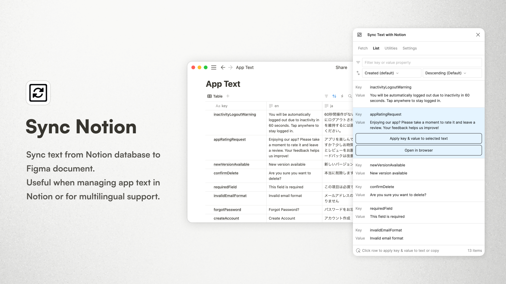

# Sync Text with Notion Figma Plugin

Sync text from Notion database to Figma document.  
Useful when managing app text in Notion or for multilingual support.  
\-  
NotionのデータベースからFigmaのドキュメントにテキストを同期するプラグインです。  
アプリケーションのテキストをNotionで管理したい場合や多言語対応をしたい場合に便利です。

## 🔥 How to use / 使い方

### Fetch tab / 「取得」タブ
Fetches text from a database in Notion. The data is cached to this document and restored at next time it is launched. If you have updated Notion database, fetch again.  
\-  
Notionのデータベースからテキストを取得します。取得したテキストはこのドキュメントにキャッシュされ、次回起動時に復元されます。もしNotionのデータベースを更新した場合は、再度取得してください。

#### 1. Database ID / データベースID
Specify the Notion database ID ([Reference](https://developers.notion.com/reference/retrieve-a-database)).  
\-  
NotionのデータベースIDを指定します ([参考](https://developers.notion.com/reference/retrieve-a-database))。

#### 2. Integration token / インテグレーショントークン
First, create a new integration in Notion ([Reference](https://developers.notion.com/docs/create-a-notion-integration#create-your-integration-in-notion)).  
Next, give your integration page permissions ([Reference](https://developers.notion.com/docs/create-a-notion-integration#give-your-integration-page-permissions)).  
Input the copied token.  
\-  
まず、Notionで新しくインテグレーションを作成します ([参考](https://developers.notion.com/docs/create-a-notion-integration#create-your-integration-in-notion))。  
次に、作成したインテグレーションにデータベースへのアクセス権限を与えます ([参考](https://developers.notion.com/docs/create-a-notion-integration#give-your-integration-page-permissions))。  
コピーしたトークンを入力してください。

#### 3. Key property name / キーのプロパティ名
Specify the name of the property that is the key of the data to be fetched (e.g. Name, Key, Title, etc.).  
Currently, title, formula and text properties are supported.  
\-  
取得するデータのキーとなるプロパティ名を指定します (例: Name、Key、Titleなど)。  
現在、タイトル、フォーミュラ、テキストプロパティが対応しています。

#### 4. Value property name / 値のプロパティ名
Specify the name of the property that is the value of the data to be fetched (e.g. Value, en, ja, etc.).  
Currently, title, formula and text properties are supported.  
\-  
取得するデータの値となるプロパティ名を指定します (例: Value、en、jaなど)。  
現在、タイトル、フォーミュラ、テキストプロパティが対応しています。

After entering the information for steps 1-4, click the "Fetch text from Notion" button to retrieve the text. Depending on the number of items in the database, this process may take some time.  
To delete the cache, click the "Clear cache" button.  
\-  
1-4を入力したら、「Notionからテキストを取得」ボタンをクリックし、テキストを取得します。データベースの項目数によっては、しばらく待つ必要があります。  
キャッシュを削除する場合は、「キャッシュを削除」ボタンをクリックしてください。

### List tab / 「リスト」タブ
Text retrieved from Notion will be displayed. Keys and values can be copied.  
You can also filter by key or value and change the sort order.  
Click on a row to display the following two buttons.  
\-  
Notionから取得したテキストが表示されます。キーと値をコピーすることができます。  
また、キーや値で絞り込むことができ、並び順も変更することができます。  
行をクリックすると、以下の2つのボタンが表示されます。

#### "Apply key & value to selected text" button / 「選択したテキストにキーと値を適用」ボタン
Select text in Figma and click the button to apply the key and value to the text.  
\-  
Figmaのテキストを選択し、ボタンをクリックすると、テキストにキーと値が適用されます。

#### "Open in browser" button / 「ブラウザで開く」ボタン
Open the page of text in Notion in browser.  
\-  
Notionの該当するテキストのページをブラウザで開きます。

### Utilities tab / 「ユーティリティ」タブ
Several actions are available to help synchronize Notion text with Figma.  
\-  
NotionのテキストをFigmaと同期するのに便利な、いくつかのアクションが用意されています。

#### Target text range / 対象テキストの範囲
Select the range of text to be the target of the action. You can choose from the selected elements, the current page, or all pages.  
You can also choose to include text in components or instances.  
\-  
アクションの対象にするテキストの範囲を選択します。選択した要素、現在のページ、すべてのページから選択することができます。  
また、コンポーネント内のテキストやインスタンス内のテキストを対象にすることもできます。

#### "Apply value to text" button / 「テキストに値を適用」ボタン
If the name of the text layer is #\<key\> (e.g. #userInfo), the text content will be replaced. If the value has an embedded variable, a parameter can be passed to the layer name (e.g. #userInfo?name=John&age=24). If the value is "Name: {name} / Age: {age}", the text content will be "Name: John / Age: 24".  
\-  
テキストレイヤーの名前が#<キー>になっている場合(例: #userInfo)、テキストの内容を置き換えます。値に変数が埋め込まれている場合、レイヤー名にパラメータを渡すことができます(例: #userInfo?name=ジョン&age=24)。値が「名前: {name} / 年齢: {age}」の場合、テキストの内容は「名前: ジョン / 年齢: 24」となります。

#### "Rename layer" button / 「レイヤー名を変更」ボタン
If the text content has the same value in the database, rename the layer to #\<key\>. This is useful when renaming layers is troublesome.  
\-  
テキストの内容がデータベースの値と一致している場合、レイヤー名を#<キー>に変更します。レイヤーのリネームが面倒な場合に便利です。

#### "Highlight text" button / 「テキストをハイライト」ボタン
Highlight the text layer with the name #\<key\>. If the key exists in the database, it is highlighted in blue; if it does not exist or the key is incorrect, it is highlighted in red. This is useful to verify that layer names are formatted correctly or that there are no typos.  
\-  
テキストレイヤーの名前が#<キー>になっているものをハイライトします。キーがデータベースに存在する場合は青色、存在しない場合またはキーが間違っている場合は赤色でハイライトされます。レイヤー名が正しくフォーマットされているか、またはタイプミスがないかを確認するのに便利です。

### Settings tab / 「設定」タブ
#### Language / 言語
Select the language of this plugin. Currently, English and Japanese are available.  
\-  
このプラグインの言語を選択します。現在、英語と日本語が選択できます。

## 📮 Support

If you have any plobrem or feedback, please use the [GitHub Issues](https://github.com/ryonakae/figma-plugin-sync-notion/issues).

---

This plugin is made by Ryo Nakae 🙎‍♂️.

- https://brdr.jp
- https://x.com/ryo_dg
- https://github.com/ryonakae
